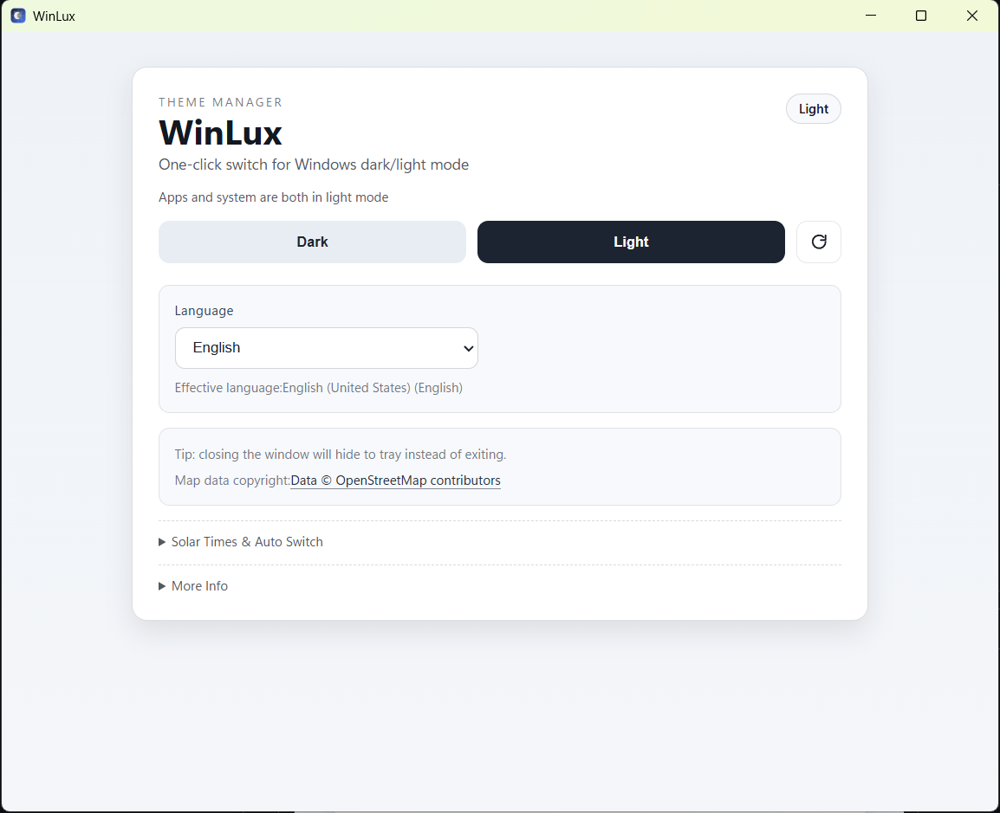
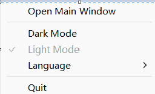

# WinLux

[简体中文](./README.zh-CN.md)

WinLux is a lightweight, Windows-only desktop utility built with Tauri 2 + React.
It lets you quickly switch Windows light/dark themes, stay in the system tray, and manage app language preferences.

## Table of Contents

- [Features](#features)
- [Screenshots](#screenshots)
- [Tech Stack](#tech-stack)
- [Requirements](#requirements)
- [Quick Start](#quick-start)
- [Scripts](#scripts)
- [Validation](#validation)
- [Project Structure](#project-structure)
- [Language Notes](#language-notes)
- [License](#license)

## Features

- One-click switch between dark and light mode (for both Apps and System).
- Reads and writes Windows theme settings from:
  - `HKCU\Software\Microsoft\Windows\CurrentVersion\Themes\Personalize`
- System tray support:
  - Open main window
  - Quick switch to dark/light mode
  - Change language preference
  - Quit app
- Close-to-tray behavior (closing the window hides it instead of exiting).
- Language preference support (`auto` follow-system or manual selection).
- NSIS installer language selection with 30 language options.

## Screenshots

| Main Window | Tray Menu |
| --- | --- |
|  |  |
| Main interface | Tray quick actions |

## Tech Stack

- Frontend: React 18 + TypeScript + Vite
- Desktop runtime: Tauri 2
- Backend: Rust + `winreg`
- Package manager: Bun

## Requirements

- Windows 10 or Windows 11
- Bun (recommended latest stable)
- Rust stable toolchain (MSVC target)
- Tauri prerequisites for Windows (WebView2 / build tools)

## Quick Start

```bash
bun install
bun run tauri:dev
```

The app UI will open as a desktop window, and can also be controlled from the tray icon.

## Scripts

| Command | Description |
| --- | --- |
| `bun run dev` | Run Vite frontend only (`http://localhost:5173`) |
| `bun run build` | Type-check and build frontend assets into `dist/` |
| `bun run typecheck` | Run TypeScript checks only |
| `bun run tauri:dev` | Run the Tauri desktop app in development mode |
| `bun run tauri:build` | Build desktop distributables (NSIS target) |
| `bun run release` | Build release with version inferred from latest Git tag |
| `bun run icon:gen` | Generate Windows icon assets |

## Validation

Before opening a PR, run at least:

```bash
bun run typecheck
cargo test -p winlux
```

## Project Structure

```text
.
├─ src/                 # React frontend and Tauri bridge
│  └─ lib/tauri.ts      # invoke wrappers + shared TS contracts
├─ src-tauri/src/       # Rust backend (commands, tray, i18n)
├─ src-tauri/icons/     # App/package icons
├─ scripts/             # Build/release helper scripts
└─ dist/                # Frontend output consumed by Tauri builds
```

## Language Notes

- Current frontend UI strings are localized for:
  - English
  - Simplified Chinese
  - Traditional Chinese
- Tray and installer language options cover 30 installer language identifiers.
- Language preference is stored at:
  - `HKCU\Software\WinLux\LanguagePreference`

## License

MIT. See `LICENSE`.
